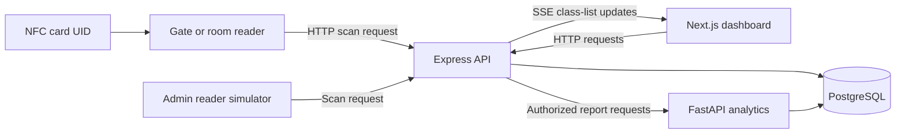

# NFC Student Card

Student identification and attendance management for school gates and classrooms. Register an NFC card to a student, record attendance through a reader, and manage students, timetables, and attendance from a web dashboard.

The core application is a Next.js frontend and an Express API backed by PostgreSQL. A built-in reader simulator lets you try the attendance workflow without physical NFC hardware.

**Explore:** [Features](#features) · [Attendance workflow](#attendance-workflow) · [Local setup](#local-setup) · [Try it out](#try-it-out) · [Configuration](#configuration) · [Development](#development) · [Project status](#project-status)

## Features

| Area | Available functionality |
| --- | --- |
| Student records | Create, search, edit, and delete students; manage official student IDs, class sections, and linked card UIDs. |
| Gate attendance | Toggle daily check-in/check-out and classify arrivals using the school's late cutoff and timezone. |
| Classroom attendance | Match room-reader taps to an active teacher timetable; track attendance per class slot. |
| Teacher dashboard | View daily and weekly schedules, open class lists, and mark students present, late, or absent. Class lists receive live updates through Server-Sent Events (SSE). |
| Administration | Manage account roles, teacher schedules, readers, reader assignments, school settings, and attendance activity. |
| Reader testing | Simulate taps, look up cards, and register cards from the admin interface. |
| Reports | Generate student gate, classroom, or combined reports for a date range, view summaries and history, and print the result. |
| Interface | English and Thai locale routes, responsive layouts, and light/dark themes. |

Accounts use the `USER`, `TEACHER`, and `ADMIN` roles. New registrations receive `USER`; an administrator can assign staff roles. Student records are separate from login accounts. Authentication uses bcrypt password hashes and JWTs stored in an HTTP-only cookie.

## Attendance workflow



1. Create a student and link a card UID to their official student ID.
2. Create an active reader with type `GATE` or `ROOM`. Room readers also need teacher assignments and a matching timetable.
3. Submit a scan containing the reader ID and card UID. The API identifies the student and applies the reader's attendance rules.
4. Review activity in the admin dashboard or view today's class list as a teacher.

| Reader | Attendance behavior |
| --- | --- |
| `GATE` | Keeps one record per student per school day. Each tap toggles `IN`/`OUT`; an arrival at or after the configured cutoff is `LATE`. The record retains the first arrival and updates subsequent arrival/departure fields. |
| `ROOM` | Requires exactly one active schedule across the reader's assigned teachers. Records `PRESENT` at the start minute or `LATE` afterward. Repeated taps for the same student, room, subject, period, and date reuse the existing record. |

Class lists select students whose `classSection` matches the timetable's `className`. A student without a room attendance record appears as `ABSENT`. The default school timezone is `Asia/Bangkok`, with a gate late cutoff of `08:00`.

## Local setup

### Prerequisites

- Node.js 20.9 or newer and npm.
- Docker with Docker Compose for the database, or an existing PostgreSQL instance. The supplied Compose configuration uses PostgreSQL 16.

Run the following commands from a local checkout. The frontend and backend have separate dependencies and lockfiles; there is no root npm workspace.

### 1. Configure the backend

```sh
cd backend
npm ci
```

Copy `backend/.env.example` to `backend/.env` if you do not already have an environment file. From the `backend` directory, use the command for your shell:

```powershell
# PowerShell
Copy-Item .env.example .env
```

```sh
# macOS / Linux
cp .env.example .env
```

Set `JWT_SECRET` and `READER_DEVICE_SECRET` to your own values. The example database credentials and connection URL are aligned for running PostgreSQL in Docker and the API on your host.

### 2. Start the database and API

From `backend`:

```sh
npm run docker:db
```

Wait for the database to become healthy (`docker compose ps`), then initialize it and start the API:

```sh
npm run db:generate
npm run db:deploy
npm run db:seed
npm run dev
```

If you already run PostgreSQL, skip `docker:db` and set `DATABASE_URL` to that database before applying migrations.

The seed creates an administrator with username **`admin`** and password **`admin`**. It does not create students, readers, or schedules. Running it again resets that account's password to `admin` and role to `ADMIN`; use it only for local setup and change the password before using a shared environment.

### 3. Start the frontend

In a second terminal, from the project root:

```sh
cd frontend
npm ci
npm run dev
```

The frontend defaults to `http://localhost:3100` for API requests. To change it, create `frontend/.env.local` with:

```dotenv
NEXT_PUBLIC_API_URL=http://localhost:3100
```

| Service | Local address |
| --- | --- |
| Web application | [localhost:3000](http://localhost:3000) |
| English login | [localhost:3000/en/login](http://localhost:3000/en/login) |
| Thai login | [localhost:3000/th/login](http://localhost:3000/th/login) |
| API | [localhost:3100](http://localhost:3100) |
| Swagger UI in development | [localhost:3100/api-docs](http://localhost:3100/api-docs) |

### 4. Start analytics for the Reports page

In another terminal, from `backend`:

```sh
docker compose up --build -d analytics
```

The analytics service connects to the same Compose database and is available to the host API at `http://127.0.0.1:8000`. Open **Reports** in the navigation, select a student, attendance type, and date range, then choose **Generate report**. The **Print** button prints the generated report without navigation or filters.

Administrators can report on all students; teachers can report on students in their currently assigned classes. Reports accept up to 366 days. For a Python-only setup or a database outside Compose, see the [analytics setup guide](analytics/README.md).

### Alternative: run the API, analytics, and database in Docker

After configuring `backend/.env`, run from `backend`:

```sh
npm run docker:up
```

Once the API has started, create the local administrator:

```sh
docker compose exec api npm run db:seed
```

The API image generates Prisma Client and compiles TypeScript during the build, then applies migrations on startup. Compose supplies a database URL using the internal `db` hostname and connects the API to `http://analytics:8000`. Start the frontend separately using step 3; Compose includes the API, analytics, and database. Use this alternative in place of the host API to avoid a port conflict.

Use `npm run docker:logs` to follow container logs and `npm run docker:down` to stop the stack. Database data persists in the `postgres_data` volume. The API container runs in production mode and sets secure authentication cookies; use HTTPS when accessing it outside localhost.

## Try it out

### Record a gate visit without hardware

1. Sign in with the seeded administrator account and open **Students** at `/en/admin/students`.
2. Add a student with a numeric official student ID and a class section.
3. Open `/en/admin/reader` and create a `GATE` reader.
4. Open **Test** at `/en/admin/test`, select the reader, and enter a sample hexadecimal UID such as `04a1b2c3d4`.
5. Select **Register card**, enter the student's official student ID, and use your backend `READER_DEVICE_SECRET` as the registration device token.
6. Select **Tap** and process the tap to check the student in. Tap again to check them out, then review `/en/admin/activity`.

The simulator writes attendance to the database. Scan UIDs must contain 6–32 hexadecimal characters and are normalized to lowercase.

### Try classroom attendance

Register another login account and use the admin **Accounts** page to assign it the `TEACHER` role and a timetable. Use a timetable class name that exactly matches the student's class section. Create a `ROOM` reader and assign that teacher to it.

During the scheduled class time, simulate a tap using the room reader. Sign in as the teacher and open the class from the dashboard to see attendance and adjust statuses. Room scans return a conflict if there is no active class, no assigned teacher, or more than one matching active schedule.

## Configuration

Backend values are documented in [`backend/.env.example`](backend/.env.example).

| Variable | Purpose |
| --- | --- |
| `PORT` | API port; defaults to `3100`. In Compose, controls the published host port while the container listens on `3100`. |
| `DATABASE_URL` | PostgreSQL connection string for Prisma. Use `localhost` for a host API and `db` for the Compose API. |
| `JWT_SECRET` | Secret used to sign and verify login tokens. |
| `FRONTEND_ORIGIN` | Allowed browser origin for credentialed CORS; defaults to `http://localhost:3000`. |
| `READER_DEVICE_SECRET` | Shared token for card registration via the `X-Device-Token` header. |
| `ANALYTICS_URL` | Internal analytics address used by Express; defaults to `http://127.0.0.1:8000`. Compose sets it to `http://analytics:8000`. |
| `ANALYTICS_PORT` | Analytics port published on localhost by Compose; defaults to `8000`. Match `ANALYTICS_URL` when using a different host port. |
| `ANALYTICS_SERVICE_TOKEN` | Optional internal token shared by Express and analytics. Both fall back to `JWT_SECRET` when unset; it is never sent to the browser. |
| `POSTGRES_USER`, `POSTGRES_PASSWORD`, `POSTGRES_DB` | Database initialization settings used by Compose. Keep the host `DATABASE_URL` consistent with these values. |
| `DB_PORT` | Published PostgreSQL port; defaults to `5432`. Update the host `DATABASE_URL` if changed. |
| `NEXT_PUBLIC_API_URL` | Frontend setting in `frontend/.env.local`; defaults to `http://localhost:3100`. Set it before building for deployment. |

Card registration and attendance scans use different credentials: registration uses the shared `READER_DEVICE_SECRET`, while each reader has its own generated `deviceToken` for scans.

## API guide

The route definitions in [`backend/index.ts`](backend/index.ts) are the complete route inventory. Swagger UI documents annotated routes, so it does not cover every endpoint. Its current source-file glob also means the compiled Docker image may show incomplete documentation.

| Route group | Purpose |
| --- | --- |
| `/auth/*` | Registration, login, session lookup, profile updates, and logout. |
| `/dashboard/schedule` | The signed-in account's timetable. |
| `GET /analytics/students` | Students available for the signed-in staff member's reports. |
| `GET /analytics/reports/student/:studentId` | Student metadata, summary, and history. Accepts `start`/`end` (`YYYY-MM-DD`, inclusive) and `kind` (`all`, `gate`, `room`). Uses the student's internal UUID. Append `/history`, `/analysis`, or `/csv` for individual formats. |
| `/dashboard/namelist/:entryId` | Today's class list, with student-status updates and an `/events` SSE stream. Requires a teacher assigned to the entry or an administrator. |
| `/admin/*` | Account, student, reader, attendance, and school-settings administration. |
| `POST /student` | Create a student record. |
| `POST /card/register` | Link a card using `{ "studentId": "12345", "cardUid": "04a1b2c3d4" }` and `X-Device-Token`. Here `studentId` is the official student ID. |
| `POST /admin/reader/scan` | Submit `{ "readerId": "<reader-id>", "cardUid": "04a1b2c3d4" }` using an admin session or the reader's `X-Reader-Token`. |

Add `"dryRun": true` to a scan request to validate the reader and card lookup without writing attendance. A dry run does not check classroom schedule availability.

## Development

### Repository map

```text
NFC-student-card/
├── frontend/             Next.js application
│   └── src/
│       ├── app/[locale]/ Dashboard, schedules, class lists, login, and admin pages
│       ├── i18n/         Locale routing and request configuration
│       └── messages/     English and Thai translations
├── backend/              Express API, Dockerfile, and Compose configuration
│   ├── index.ts          Server entry point and route registration
│   ├── src/              Controllers, interfaces, authentication, and SSE helpers
│   └── prisma/           Database schema, migrations, and administrator seed
├── analytics/            FastAPI reports over GateLog and RoomLog, plus tests
├── hardware/             Placeholder for hardware integration
└── .github/ISSUE_TEMPLATE/ Bug reports, feature requests, and user stories
```

### Technology

| Layer | Main tools |
| --- | --- |
| Web | Next.js 16, React 19, TypeScript, Tailwind CSS 4, TanStack Query, Axios, next-intl, Motion |
| API | Express 5, TypeScript with ES modules, Prisma 6, JWT, bcrypt, Swagger UI |
| Data and local infrastructure | PostgreSQL 16, Docker Compose |
| Analytics | Python, FastAPI, SQLAlchemy |

Exact dependency versions are maintained in the [frontend manifest](frontend/package.json), [backend manifest](backend/package.json), their lockfiles, and [analytics requirements](analytics/requirements.txt).

### Common commands

Run each command from the directory shown.

| Directory | Command | Purpose |
| --- | --- | --- |
| `frontend` | `npm run dev` | Start the Next.js development server. |
| `frontend` | `npm run lint` | Run ESLint. |
| `frontend` | `npm run build` / `npm start` | Build / serve the production frontend. |
| `backend` | `npm run dev` | Run the API with TypeScript watch mode. |
| `backend` | `npm run build` / `npm start` | Compile / run `dist/index.js`. |
| `backend` | `npm run db:generate` | Regenerate Prisma Client after schema changes. |
| `backend` | `npm run db:migrate` | Create and apply migrations during schema development. |
| `backend` | `npm run db:deploy` | Apply committed migrations. |
| `backend` | `npm run db:studio` | Inspect database records with Prisma Studio. |

For application changes, run the frontend lint and build commands and the backend build, then exercise the relevant workflow locally. Report tests cover PostgreSQL queries, date boundaries, lateness, CSV output, staff access, and the Express-to-analytics connection; see [analytics testing](analytics/README.md#testing) for the isolated test setup.

### Troubleshooting

| Symptom | Check |
| --- | --- |
| API cannot connect to PostgreSQL | Check `docker compose ps`, database credentials, and whether `DATABASE_URL` needs `localhost` or `db`. |
| Missing tables or generated Prisma types | Apply `db:deploy` and run `db:generate` from `backend`. |
| Browser requests fail or login does not persist | Match `NEXT_PUBLIC_API_URL` to the API address and `FRONTEND_ORIGIN` to the browser origin. Use a consistent hostname and restart after environment changes. |
| Empty class list | Match the student's `classSection` to the timetable's `className`. |
| Room scan returns `409` | Check teacher assignments, school timezone, and overlapping or missing timetable entries. |
| Reports cannot be generated | Start analytics, check `ANALYTICS_URL`, and ensure both services use the same internal token and database. |

## Project status

The web dashboard, API, reader simulation, role management, and gate/classroom attendance workflows are implemented in this repository.

- **Hardware:** `hardware/` is a placeholder. Reader-facing HTTP endpoints exist, but firmware and physical device setup instructions are not included yet.
- **Analytics:** Reports use `GateLog` and `RoomLog`. Gate lateness is calculated from the first arrival using the current school cutoff. Reports describe recorded attendance, not every card tap or inferred absences. The old `analytics/seeder.py` still targets the legacy schema and truncates tables; do not use it with the current application.
- **Live updates:** Class-list SSE subscriptions are held in API-process memory. Multiple API instances would need a shared event mechanism.
- **Other clients and notifications:** No mobile app or automated notification service is included yet.
